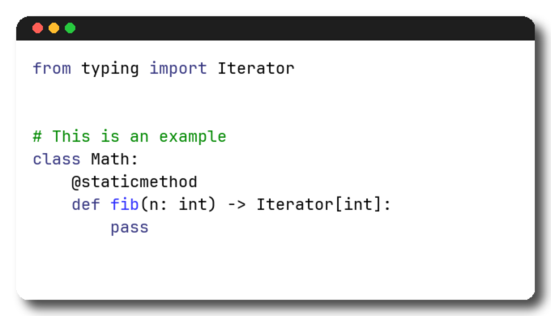

# Tool

**Tool** is a Python-based tool for generating beautiful, high-quality images of code with syntax highlighting, rendered in a macOS-style terminal window. Built for automation and easy customization, it can be easily integrated into scripts or pipelines.



---

## ✨ Features

- **Syntax Highlighting** – Utilizes Pygments with support for dozens of languages.
- **macOS-style Terminal UI** – Recreates the terminal header and shadow.
- **Fonts** – Use any TTF font, comes with JetBrains Mono for elegant, readable code.
- **Fully Scriptable** – Designed to run headlessly from scripts, CI pipelines, or other Python apps.
- **Easily Customizable** – Modify themes, fonts, window styles, and more in plain Python.
- **Self-contained** – No need for browsers or servers. Everything runs locally.

---


## Installation

```bash
pip install tool
```

## Command Line Usage

Render the code in `test.py` in a default 80x24 window. By default, the window scrolls with the code and only the last 24 rows will be shown if the code does not fit into the window.

```bash
python render_code_terminal.py test.py
```

Use the `--columns` and `--rows` options to extend the window.
```bash
python render_code_terminal.py test.py --rows 40
```

## Programmatic Usage

```python
from x import Tool

tool = Tool()
tool.render_to_file(
    code='print("Hello, world!")',
    output_path='hello_world.png'
)
```

A slightly more custom way to call the tool is to create a `RenderConfig` to overwrite specific parameters.

```python
config = RenderConfig(
    shadow_offset = 20,
    shadow_blur = 3,
    shadow_color = "purple",
    shadow_alpha = 220,
)
renderer = Renderer(
    code='print("Hello, world!")',
    config=config,
)

# optionally modify a specific layer
renderer.render_background_layer(first_color=start_color, second_color=end_color)

# render all layers
renderer.render()
renderer.final_image.show()
```

Tool renders four distinct layers: background, shadow, text, and title bar. They are composited into the final image. This approach allows the modification of individual layers for an animation without having to re-render any other layers.

```python

renderer.bg_layer
renderer.shadow_layer
renderer.text_layer
renderer.titlebar_layer
renderer.final_image
```

## Font

The tool comes with the [JetBrainsMono](https://github.com/JetBrains/JetBrainsMono) font. Direct the tool to your fonts folder for more font choices.


## Alternatives

[Raycast](https://www.codepng.app/)
[codepng](https://www.codepng.app/)
[Code Beautify](https://codebeautify.org/)

## Font License

JetBrains Mono typeface is available under the [OFL-1.1 License](https://github.com/JetBrains/JetBrainsMono/blob/master/OFL.txt) and can be used free of charge, for both commercial and non-commercial purposes. You do not need to give credit to JetBrains, although we will appreciate it very much if you do. See [JetBrainsMono License](https://github.com/JetBrains/JetBrainsMono?tab=readme-ov-file#license) 

## License
